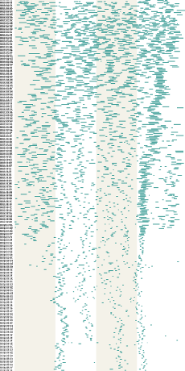

# Inf(ant)ographics

Tools for generating graphs with data collected about our baby

## Example

Breastfeeding data for Rae, age 11 months (scaled and squashed). Originally generated as an svg.

`infantographics -t calendar-grid source.xlsx feeding_11months_grid.svg`

